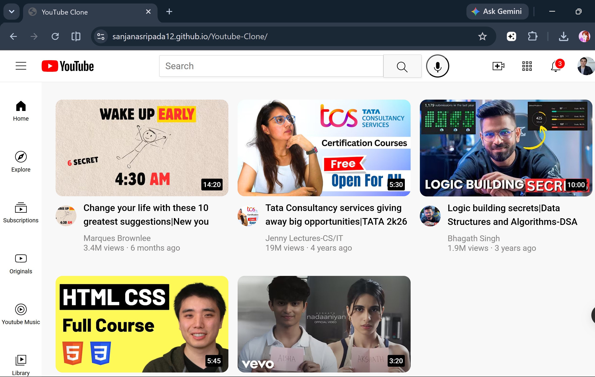

# 📺 YouTube Clone

A simple and responsive **YouTube Clone** built using **HTML and CSS**. This project recreates the user interface of YouTube, featuring a responsive video grid, navigation sidebar, search bar, header, tooltips, and video cards for a modern browsing experience.

---

## 📌 Features

- 🎥 Responsive YouTube homepage layout
- 🔍 Search bar with search and voice search icons
- 📂 Sidebar navigation menu
- 📺 Video thumbnail cards with duration badges
- 👤 Channel profile pictures and channel tooltips
- 🔔 Notification icon with notification count
- 📱 Responsive design for different screen sizes
- 🎨 Clean and modern YouTube-inspired user interface
- 🖱️ Hover effects and interactive tooltips

---

## 🛠️ Technologies Used

- HTML5
- CSS3

---

## 🚀 Live Demo

🔗 **Live Demo:** https://sanjanasripada12.github.io/Youtube-Clone/

---

## 📸 Screenshots

### Homepage



---

## 📂 Project Structure

```text
Youtube-Clone/
│
├── index.html
├── youtube-clone/
│   ├── styles/
│   │   ├── general.css
│   │   ├── header.css
│   │   ├── sidebar.css
│   │   └── video.css
│   │
│   ├── icons/
│   │   └── (SVG icons)
│   │
│   ├── thumbnails/
│   │   └── (Video thumbnails)
│   │
│   └── channel-pictures/
│       └── (Channel images)
│
├── Youtube-Clone.png
└── README.md
```

---

## 🚀 How to Run

1. Clone the repository

```bash
git clone https://github.com/SanjanaSripada12/Youtube-Clone.git
```

2. Open the project folder

```bash
cd Youtube-Clone
```

3. Open `index.html` in your browser.

No installation or additional libraries are required.

---

## 📖 How It Works

1. Open the application in your browser.
2. Browse through the responsive YouTube homepage.
3. Use the search bar to simulate video searching.
4. Hover over icons to view interactive tooltips.
5. Click on video thumbnails to open linked YouTube videos.
6. Explore the sidebar navigation for different sections.

---

## 💡 Future Improvements

- ▶️ Video playback page
- 🔍 Functional search feature
- 🌙 Dark Mode
- 📱 Enhanced mobile responsiveness
- ❤️ Like, Comment, and Subscribe buttons
- 🎬 Dynamic videos using JavaScript
- 🔗 Fetch videos using the YouTube Data API

---

## 👩‍💻 Author

**Sanjana Sripada**

GitHub: **https://github.com/SanjanaSripada12**

---

## ⭐ Show Your Support

If you like this project, please consider giving it a ⭐ on GitHub!
